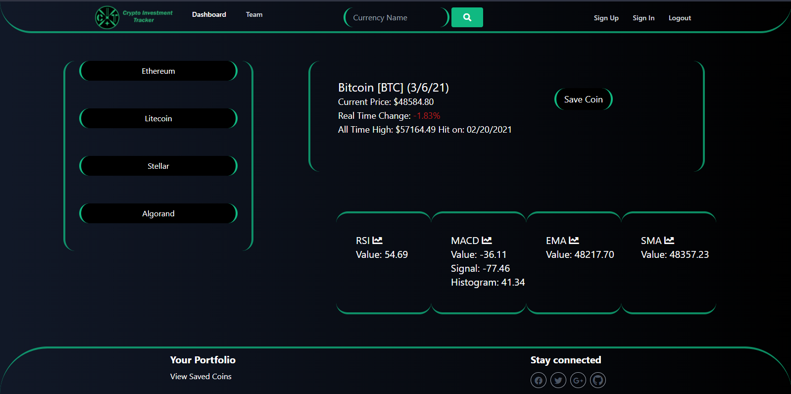

# Crypto Investment Tracker

## Description
This fullstack web  application is a tool used to empower potential crypto currency investors to explore the prices of different coins without having to sign up for an exchange. The user has the option to save coins and view them on a "Saved Coins" page which is a restricted route via passport-local technology. All user information and saved coins are stored in a MySQL database. This fullstack web application runs on an Express server and is built with the Handlebars.js template engine. The user is allowed to sign up, sign in, and logout using the passport-local technology so that the user's password is automatically hashed and stored safely. 

## Table of Contents
  - [Installation](#installation)
  - [Deployment](#deployment)
  - [Usage](#usage)
  - [Technologies](#technologies)
  - [Code Snippets](#code-snippets)
  - [License](#license)
  - [Next Steps](#next-steps)
  - [Authors](#Authors)


## Installation
``` There are no special steps required to install this application as it is a live, deployed application with a deployment link. ```

## Deployment
* Deployed Application URL: https://crypto-investment-tracker.herokuapp.com/

## Usage
Simply click on the deployed application link and type the name of your favorite crypto currency coin into the search to get the most current price and information regarding that coin.



## Technologies
* HTML5 
* CSS3 
* JavaScript
* jQuery 
* Axios
* Ajax
* Tailwind CSS
* Node.js
* MySQL
* Sequelize 
* Express.js 
* Handlebars.js
* Passport/passport-local & bycrypt.js (for user authentication and password hashing)
* Heroku
* APIs:
  * Coin Rainking: https://developers.coinranking.com/api/documentation/
  * Taapi: https://taapi.io/
    * MACD: https://taapi.io/indicators/macd/
    * RSI: https://taapi.io/indicators/relative-strength-index-rsi/
    * EMA: https://taapi.io/indicators/exponential-moving-average/
    * SMA: https://taapi.io/indicators/simple-moving-average/

## Code Snippets
### Axios
```
// Axios call to bybass cors error in the front-end

  // RSI
  app.get("/api/coin/rsi/:coin", (req, res) => {
    axios.get("https://api.taapi.io/rsi", {
      params: {
        secret: "removed",
        exchange: "binance",
        symbol: `${req.params.coin}/USDT`,
        interval: "1h",
      }
    }).then(function (response) {
      console.log("rsi", response.data);
      res.json(response.data);
    }).catch(function (error) {
      console.log(error.response.data);
    });
  });
```
### Passport Middleware
```
// This is middleware for restricting routes a user is not allowed to visit if not logged in

module.exports = function(req, res, next) {
  // If the user is logged in, continue with the request to the restricted route
  if (req.user) {
    return next();
  }

  // If the user isn't logged in, redirect them to the sign-in page
  return res.redirect("/sign-in");
};

```
### Passport Restricted Route
```
// Route that has our "isAuthenticated" middleware is passed as a parameter
// If the user is signed in, let them access the /coins route

  app.get("/coins", isAuthenticated, function(req, res) {
    db.Coin.findAll({
      where: {
        UserId: req.user.id
      }
    }).then((dbCoin) => {
      console.log("rendering coins view");
      res.render("coins", { coins: dbCoin });
    });
  });
```

## License


  [MIT](https://opensource.org/licenses/MIT)
  

  

## Next Steps
* Fix responsiveness for mobile/ipad
* Add Keydown feature to search
* Add feature for the ability for the user to log a deposit and log a withdrawal on the "Saved Coins" page
* Add routes to update and delete deposits
* Add  a Total column under the user's logged deposits so user can see total deposits in that coin
* Show total box on coins page with user's total combined amount invested in cryptocurrency (add up of all coins)
* Caculate what each user's deposit is in fiat/USD equals in that coin/currency (decimal)
* Fix bug of user being able to save the coin twice into the database and therefore have it display twice on the saved coins page
* Hide sign-in and sign-up buttons when the user is signed in
* Link indicators to charts for the coin searched
* Add feature so that the current prices are shown live (see axios)
* Write tests for js files/models
* Refactor and consolidate code for readability


## Authors
For additional questions please contact:
* https://github.com/team-crypto-currency
